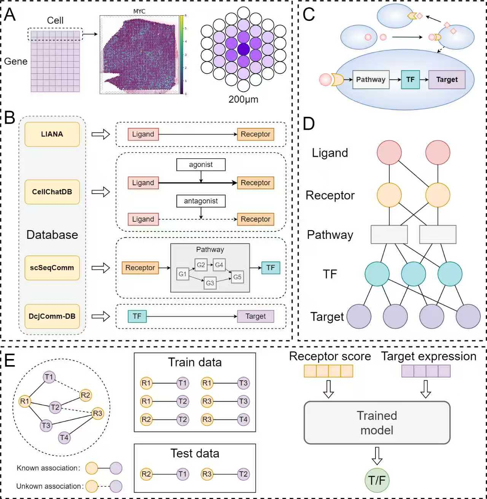

# Intercellular Communication Guides the Prediction of Intracellular Gene Regulatory Relationships

## File description
 
├dataset  
│ └Visium-19-CK297  
│ &ensp; ├──  cell-ligand.csv **#The signal intensity emitted by each cell from get-gene-feature.py**  
│ &ensp; ├──  cell-receptor.csv **#The signal strength received by each cell from get-gene-feature.py**  
│ &ensp; ├──  gene-expression.csv **#The expression level of each gene in each cell (normalized) from get-gene-feature.py**  
│ &ensp; ├──  GRN.csv  
│ &ensp; ├──  pathway-scores.csv **#The strength of pathways in each cell from get-tf-score.py**  
│ &ensp; ├──  post-data.csv  
│ &ensp; ├──  test-data.pt  
│ &ensp; ├──  TF-feature.csv **#The expression intensity of TF in each cell from get-tf-score.py**  
│ &ensp; ├──  train-data.pt  
│ &ensp; └──  val-data.pt  
├input-data **#This folder contains multiple spatial transcriptome data in. h5ad format.**    
│ ├── E9.5-E1S1.MOSTA.h5ad  
│ ├── E9.5-E2S1.MOSTA.h5ad  
│ ├── GSM4745615-DBiT-seq-processed.h5ad  
│ ├── GSM5173925-OB1-Slide01-slide-seqv2-processed.h5ad  
│ ├── MOB-processed.h5ad  
│ ├── seqFISH+.h5ad  
│ └── Visium-19-CK297.h5ad  
├resource  
│ ├human  
│ │ ├── LRdata-with-agonist-and-antagonist.csv  
│ │ ├── TF-TG-HTRIdb.csv  
│ │ ├── TF-TG-TRRUSTv2db.csv  
│ │ └── TF-TGhumandb.csv  
│ ├KEGG-igraph  
│ │ ├human  
│ │ │ ├── receptor-TF.csv  
│ │ │ └── receptor-TF-detail.csv  
│ │ └mouse  
│ │ &ensp; ├── receptor-TF.csv  
│ │ &ensp; └── receptor-TF-detail.csv  
│ ├mouse  
│ │ ├── LRdata-with-agonist-and-antagonist.csv  
│ │ └── TF-TGmousedb.csv  
│ └──omni-resource.csv  
├── main.py **#This is an example using GCN model**  
├── get-data.py   
├── get-gene-feature.py **#This is the code used to calculate receptor features, corresponding to formulas 1-6 in the paper.**  
├── get-post-data.py   
└── get-TF-score.py **#This is the code used to calculate TF features, corresponding to formulas 7-8 in the paper.**  

## requirements

- python==3.9.16
- torch==1.13.1
- numpy==1.23.5
- pandas==2.2.2
- scipy==1.13.1
- liana==1.5.0
- anndata==0.9.2